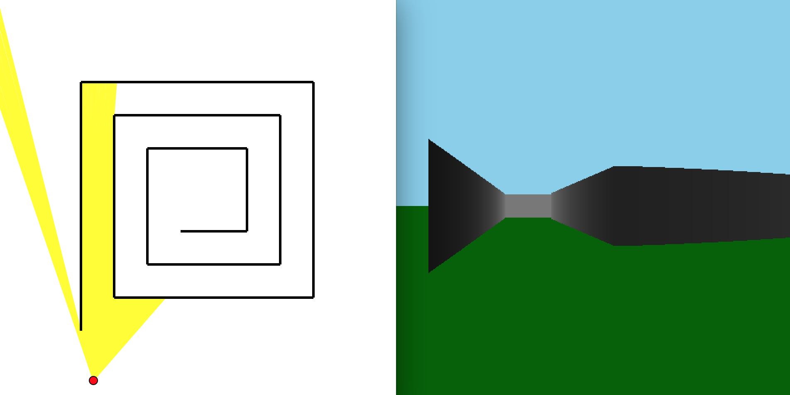
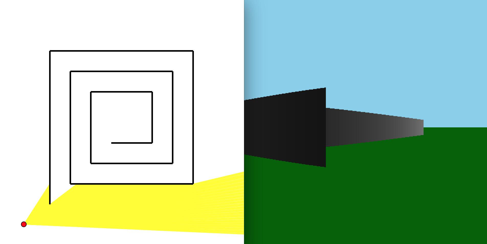
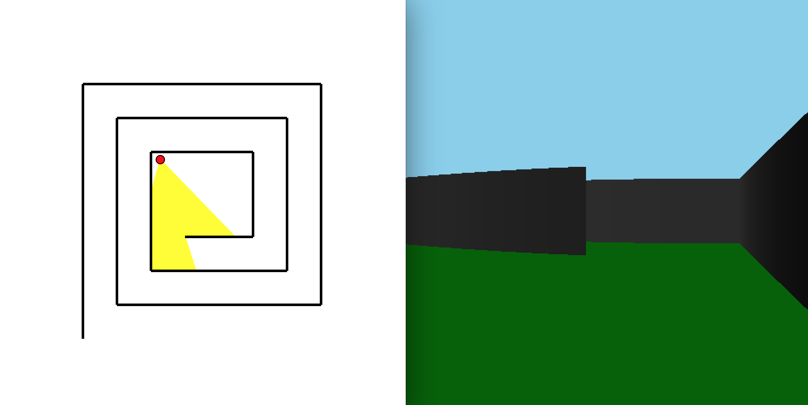

# Ray Caster

<!--ts-->
   * [Preface](#preface)
   * [Required Software and Hardware](#required-software-and-hardware)
   * [Brief Description](#brief-description)
   * [Instructions](#instructions)
      * [Starting the program](#starting-the-program)
      * [Ray Caster - 2D View](#ray-caster-\--2d-view)
      * [Ray Caster - Rendering](#ray-caster-\--rendering)
      * [Control Summary](#control-summary)
   * [Results](#results)
<!--te-->

Preface
============
The following is documentation for a Ray Caster application designed and built by Ron Broner during Summer 2020. All code and accompanying documentation was written by and is the sole property of Ron Broner. No outside material or code of any kind was used in any shape or form during the creation of this project. All code is documented on the personal GitHub account of Ron Broner as a public repository which can be seen at https://github.com/ronbroner/ray_caster

Required Software and Hardware
============
No third party software or hardware is required to run the software. It is highly recommended that you have the most recent version of Python (3.7 at the time of writing) although the program will still work on version 2.

Brief Description
============
Ray casting is a subset of ray tracing, which is a way of modeling three dimensional computer graphics using optical physics techniques. Even though the two phrases are often used interchangeably, Ray casting is a bit simpler computationally than full ray tracing. The reason for this is that ray tracing requires analyzing each ray recursively which can at times be extremely computationally intensive. I built a ray caster from scratch using only the default python 3.7 libraries, particularly the graphics library Tkinter and the standard math library.
The main idea behind ray casting is to create a "point source” of light on a two dimensional plane, with rays emanating in all directions. In addition to this light source, the plane is covered with many "obstacles” which block light (the rays) from passing through, as one would expect in the physical world. These intersection points provide extremely valuable information and calculating them while updating the rays to reflect their shortened path is the first step in rendering a full three dimensional ray cast image.
The next step is to take this list of rays and for each one, in another window, draw a corresponding thin tall rectangle. This rectangle must scale in its height and brightness with the length of the original ray in the two dimensional plane. When many rays are stacked close together these rectangles also get stacked close together to create a smooth gradient. All together you can start from many one dimensional lines in initial ray caster and render them as many two dimensional rectangles with variable brightness and size to create the illusion of depth perception.

Instructions
============

Starting the program
------------
In order to start the program, first download the file "broner project.tar.gz” unzip and untar the file. Enter the resulting directory. To start the program simply open a terminal and enter `./ray_caster.py`. This should open two windows side by side: Ray Caster - 2D View on the left and Ray Caster - Rendering on the right. While the various controls and tools available to the user are designed to affect the two windows separately, in order to save the user the trouble of having to click back and forth between the two windows, all the interactions are with the window on the left (Ray Caster - 2D view) and the window on the right (Ray Caster - Rendering) will automatically update accordingly. At any point you can quit the program by pressing the &lt;Enter&gt; key (instead of having to close both windows manually).

Ray Caster - 2D View
------------
The first window is the two dimensional "birds eye view" of the scene. The location of the cursor (initialized to the top left corner) is the source of rays. By moving the mouse around the window you can move around the light source. You can also use the up/down arrow keys to move forward/backward respectively in the direction of the middle ray. The small red dot indicates the current location of the light source and point of view. This dot follows either the mouse pointer location or the up/down key directions given by the user. In order to recreate a realistic point of view, the angle subtended by all the rays is defined to be 60 degrees. You can use the &lt;Left&gt; and &lt;Right&gt; arrow keys to rotate this angle counter-clockwise or clockwise respectively. These rays are blocked by the various obstacles which are either pre-defined or created by the user in real time. Note that obstacles are defined to be simple line segments. To create a more complicated obstacle (i.e. a box) you can combine many of these lines. In order to create a new obstacle, click once to place the first point of the new obstacle. You will then see that the second point will follow around your mouse pointer until you click again, where the second coordinate will be fixed in place. If you place the first point but then realize that you made a mistake or no longer wish to finish placing the obstacle you can press the &lt;Escape> key to cancel it. You can also press the &lt;Backspace&gt; key to remove the most recently place obstacle.

Ray Caster - Rendering
------------
The right window is the three dimensional rendering of the window on the left. Based on the length of the rays in the Ray Caster the set of thin vertical rectangles are drawn to create a rendering of the obstacles. What used to be the light source is now the point of view (hence the 60 degree angle which roughly corresponds to human vision). The only new control for the rendering (although again, you stay in the left window to do this) is being able to rotate the polar angle of the point of view, which simulates looking up/down by using the &lt;w&gt; key to look up and the &lt;s&gt; key to look down.

Control Summary
------------
Below is a short table describing of all the controls mentioned above. NOTE: Press buttons one at a time (try not to hold down) for best results.

| Control      | Result |
| --------- | -----:|
| &lt;LEFT&gt;  | Rotate POV angle counter clock wise |
| &lt;RIGHT&gt;      |   Rotate POV angle clock wise |
| &lt;UP&gt;       |   Move forward in the direction of the middle ray |
| &lt;DOWN&gt;  | Move backward in the direction of the middle ray |
| &lt;W&gt;      |  Rotate POV polar angle upward |
| &lt;S&gt;       |    Rotate POV polar angle downward |
| &lt;MOUSE CLICK&gt;  | First click to place first endpoint of obstacle. Second click to place second endpoint and finalize new obstacle |
| &lt;MOUSE MOVE&gt;      |   Translate location of POV (same effect as UP/DOWN) |
| &lt;ESCAPE&gt;       |   Cancel adding a new obstacle |
| &lt;DELETE&gt;  | Remove most recently added obstacle |
| &lt;ENTER&gt;      |   Quit program |

Results
============
In order to immerse the user in the three dimensional experience, I added grass be- low the rendered obstacles and a sky above them. I did this by filling in the space below and above the green and brown rectangles of the same width as the rendered walls. The location of the grass and sky constantly varies directly with the location and size of the rendered walls. I tried to have the brightness of the grass vary with distance, as with the walls. To do this I figured I would need the grass to be a matrix of squares instead of a list of long skinny rectangles. I also found that this would have O(N2) asymptotic complexity where N is the number of rays. Unfortunately in order to get really nice, smooth resolution (not blocky rectangles) N needs to be quite large (N>200) and while this may seem insignificant, having to update O(N2) objects constantly with a 60 Hz refresh rate ended up slowing down the machine by a huge amount, so I decided to give up on shading the grass for now. Shown below are some side by side images of the two dimensional ray casting and the resulting three dimensional rendering. All of these are using "maze" layout which I created. You can remove it by pressing the delete key until all the walls are gone.

